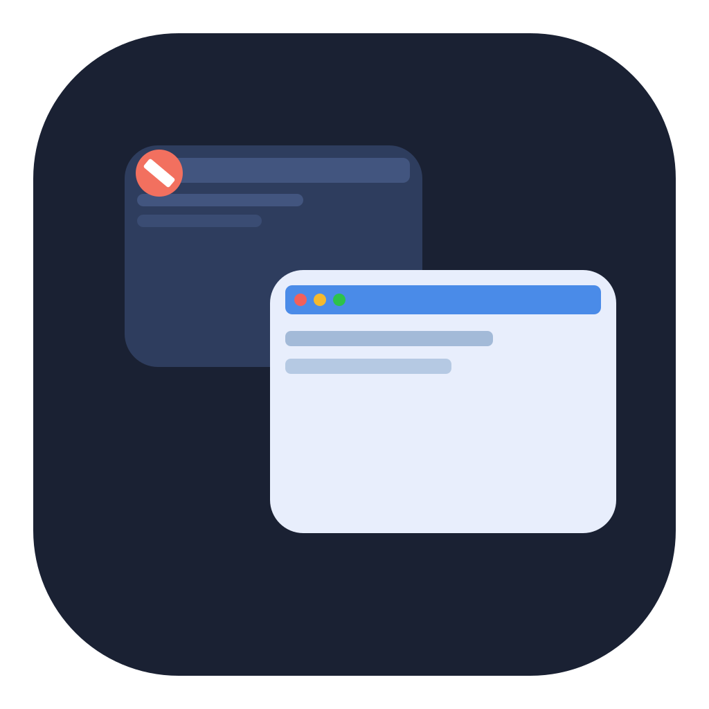

<p align="center">
  
</p>

<p align="center">
  <picture>
    <source media="(prefers-color-scheme: dark)" srcset="brand/tern-wordmark-light.svg">
    
  </picture>
</p>

<p align="center">
  <strong>Alt+Tab grátis para Mac: um alternador de janelas que deixa esconder os apps que não precisa.</strong><br>
  <kbd>⌥</kbd> <kbd>⇥</kbd> para trocar de janela · digite para buscar · <kbd>⌫</kbd> para ocultar um app
</p>

<p align="center">
  <a href="README.md">English</a> · <strong>Português</strong>
</p>

---

Tern é um alternador de janelas nativo e grátis para macOS (um Alt+Tab para Mac) que vive só na barra de menus, sem ícone no Dock. O atalho global abre um HUD para ciclar e focar janelas abertas — no espírito do [alt-tab.app](https://alt-tab.app), com um diferencial: você **oculta um app (ou uma janela)** e ele deixa de aparecer no seletor até você tirá-lo da lista.

A busca por digitação entra no download, não é extra pago. Exemplo: cinco apps abertos, um na lista de exclusões, o atalho mostra só os outros quatro.

## Tern vs AltTab

Os dois são alternadores de janelas de código aberto para Mac. O [AltTab](https://alt-tab.app) é o estabelecido: notarizado, selo de Space, prévia em tamanho real. A busca por digitação dele é um recurso Pro. O Tern traz a busca grátis e é construído em torno de esconder apps, janelas, regras por título, soneca e modos ligados ao Foco. O Tern ainda não é notarizado, então a primeira abertura pede **Abrir Mesmo Assim**. Comparativo mais longo no [site](https://tern.gitlher.me/alternativas-ao-alttab/).

## FAQ

**O Mac tem Alt+Tab?** Não. O ⌘⇥ alterna apps, não janelas. O Tern usa ⌥⇥ para alternar janela por janela.

**Por que Acessibilidade?** O macOS só deixa um app listar títulos de janela e trazer uma janela à frente com Acessibilidade ligada. O Tern não lê o conteúdo das janelas.

**Por que o aviso na primeira abertura?** O app é assinado com um certificado próprio, sem notarização da Apple. Conceda **Abrir Mesmo Assim** uma vez; as atualizações seguintes não pedem de novo. Passo a passo: [Ajuda](https://tern.gitlher.me/ajuda/).

## Baixar

Baixe o **`Tern-x.y.z.dmg`** na [última release](https://github.com/gitlherme/tern/releases/latest), abra e arraste o Tern para **Aplicativos**.

O app ainda não é notarizado pela Apple, então o macOS bloqueia a primeira abertura. Abra o Tern uma vez, feche o aviso e vá em **Ajustes do Sistema › Privacidade e segurança › Abrir Mesmo Assim**. Ou rode:

```bash
xattr -dr com.apple.quarantine /Applications/Tern.app
```

Depois conceda Acessibilidade quando o Tern pedir e aperte **⌥⇥**.

## Recursos

- App de barra de menus (`LSUIElement`), Swift + SwiftUI/AppKit.
- Atalho global configurável (padrão **⌥⇥**). O HUD sobrepõe o app da frente e o atalho **não** dispara também no browser. Segure o modificador e toque a tecla outra vez para avançar; solte o modificador para focar a janela. **⇧⇥** volta. Clique, **⏎** e **esc** também funcionam.
- **Busca:** com o seletor aberto, digite para filtrar pelo nome do app e pelo título ("vsc" acha Visual Studio Code).
- **Ações na janela:** **⌘W** fecha a janela destacada, **⌘M** minimiza e **⌘Q** encerra o app.
- Exclusão por **bundle id** (caminho principal), por janela (bundle id + título) e por **regra de título** (texto ou padrão com `*`, num app ou em qualquer app).
- **Soneca:** **⇧⌫** esconde um app por 1 hora; nos Ajustes, esconda por 1 hora, até amanhã ou sempre.
- **Modos:** listas de apps escondidos a mais (Trabalho, Pessoal…), trocadas pela barra de menus ou automaticamente por um **Foco do macOS** via Filtro de Foco.
- **Automação:** ações no app Atalhos e o esquema de URL `tern://` (veja abaixo).
- Prévia de cada janela nos cards (com permissão de Gravação da tela).
- Interface em **português e inglês** (segue o idioma do macOS; outros idiomas caem no inglês).
- Persistência das exclusões e do atalho em `UserDefaults`.
- Ajustes para gravar o atalho, conceder Acessibilidade e adicionar/remover exclusões.

No seletor: **⌫** oculta o app da janela destacada, **⇧⌫** oculta por 1 hora, **⌥⌫** oculta só aquela janela. Durante uma busca, **⌫** apaga a busca.

## Requisitos

- macOS 13 Ventura ou posterior
- Xcode 15 ou posterior
- Um Apple ID (grátis) para assinar o app localmente

## Compilar e rodar

```bash
git clone https://github.com/gitlherme/tern.git
cd tern
open Tern.xcodeproj
```

No Xcode:

1. Escolha o scheme **Tern**.
2. Em **TARGETS › Tern › Signing & Capabilities**, marque *Automatically manage signing* e escolha seu **Personal Team**. Com uma assinatura estável, as permissões de Acessibilidade e Gravação da tela continuam valendo entre builds.
3. Rode (**⌘R**). O Tern aparece na barra de menus, não no Dock.

Pela linha de comando:

```bash
xcodebuild -project Tern.xcodeproj -scheme Tern -configuration Debug -destination 'platform=macOS' build
```

### Instalar para uso diário

**Product › Archive › Distribute App › Custom › Copy App** e mova o `Tern.app` para `/Applications`. Depois adicione-o em Ajustes do Sistema › Geral › Itens de início.

## Permissões

### Acessibilidade (obrigatória)

O macOS só deixa o Tern **listar títulos de janela** e **trazer a janela escolhida para a frente** com Acessibilidade ligada.

1. Rode o Tern pelo Xcode.
2. Pressione **⌥⇥** (ou o atalho que você gravou). Se a permissão estiver off, o HUD pede Acessibilidade.
3. Clique **Abrir Ajustes do Sistema** (ou **Pedir permissão** para o diálogo nativo).
4. Ajustes do Sistema → Privacidade e segurança → **Acessibilidade**.
5. Ative **Tern**. Se o Tern não aparecer, use o **+** e escolha `Tern.app` no DerivedData ou em Produtos do Xcode.
6. Volte ao Tern e use o atalho de novo.

Se você recompilar com outro caminho ou outra assinatura, o macOS trata como um app novo: desligue e ligue de novo o Tern na lista, ou remova e adicione outra vez.

Atalho direto (Ventura/Sonoma/Sequoia):

- `x-apple.systempreferences:com.apple.preference.security?Privacy_Accessibility`
- `x-apple.systempreferences:com.apple.settings.PrivacySecurity.extension?Privacy_Accessibility`

### Monitoramento de entrada (só se o atalho vazar)

Com Acessibilidade ligada o Tern instala um event tap e **engole** o atalho, para o ⌥⇥ não rodar também no browser. Na maioria dos macOS isso basta.

Se mesmo assim o app da frente reagir ao atalho, ligue **Monitoramento de entrada** para o Tern:

Ajustes do Sistema → Privacidade e segurança → **Monitoramento de entrada**.

- `x-apple.systempreferences:com.apple.preference.security?Privacy_ListenEvent`

### Gravação da tela (prévias)

Os cards mostram uma **miniatura da janela**. O macOS exige Gravação da tela para isso. Sem a permissão o seletor **continua trocando de janela**; só a prévia some.

1. Em Ajustes do Tern, clique **Pedir permissão** (ou **Mostrar Tern.app no Finder**). Isso seleciona o Tern no Finder. Rodando pelo Xcode, ele antes copia o app para `~/Applications/Tern.app`, porque o + dos Ajustes não alcança o DerivedData.
2. Ajustes do Sistema → Privacidade e segurança → **Screen & System Audio Recording**.
3. O Tern **não entra sozinho** nessa lista. Clique no **+**, escolha `Tern.app` (o que está selecionado no Finder) ou arraste-o para a lista, e ligue o interruptor.
4. Barra de menus → **Sair**, depois rode de novo no Xcode (**⌘R**). A permissão nova só vale no próximo processo.

Com "Sign to Run Locally" (assinatura `adhoc`) cada rebuild muda o `cdhash` e o interruptor pode precisar ser religado. Assinar com o Personal Team evita isso.

- `x-apple.systempreferences:com.apple.preference.security?Privacy_ScreenCapture`
- `x-apple.systempreferences:com.apple.settings.PrivacySecurity.extension?Privacy_ScreenCapture`

## Uso

1. Conceda Acessibilidade. Para ver a prévia, conceda também Gravação da tela.
2. **⌥⇥** abre o seletor com a janela atual no índice 0 e a anterior no 1. Solte ⌥ para ir à anterior; ⇥ avança na recência. Minimizadas ficam no fim e restauram ao focar.
3. Continue com ⇥ / setas, solte ⌥ para focar, ou clique no card.
4. Comece a digitar para buscar. Depois de digitar, soltar o ⌥ não confirma mais: **⏎** abre e **esc** limpa a busca.
5. Para ocultar um app: Ajustes → Exclusões → **Adicionar app em execução…**, ou **⌫** no seletor (**⇧⌫** por 1 hora).
6. Para ocultar só uma janela: **Adicionar janela aberta…** ou **⌥⌫**. Para janelas cujo título muda, crie uma **regra por título**.
7. Modos: Ajustes → Modos. Para ligar um modo a um Foco, vá em Ajustes do Sistema › Foco › (um Foco) › Filtros de Foco › Adicionar Filtro › Tern.
8. Menu da barra: Abrir seletor, Modo, Ajustes, Procurar atualizações, Sair.

### Automação

Ações no app Atalhos: **Abrir o seletor do Tern**, **Esconder app no Tern** (sempre, 1 hora, até amanhã), **Mostrar app no Tern** e **Mudar o modo do Tern**.

Esquema de URL, para scripts, Raycast ou qualquer coisa que abra links:

| URL | Faz |
|---|---|
| `tern://open` | Abre o seletor |
| `tern://hide?app=com.spotify.client` | Esconde um app (acrescente `&for=1h` ou `&for=tomorrow` para soneca) |
| `tern://unhide?app=com.spotify.client` | Mostra de novo |
| `tern://mode?name=Trabalho` | Liga um modo; `tern://mode` desliga |

Qualquer página pode abrir um link `tern://`, então as URLs só fazem coisas inofensivas: nada fecha janelas nem encerra apps.

Não grave **⌘⇥**: o macOS reserva esse atalho para o seletor de aplicativos.

## Limitações conhecidas desta fatia

- A ordem é recência: janela atual → a anterior → demais usadas → minimizadas no fim.
- Exclusão de janela usa o título exato: se ele mudar, a janela volta. As regras por título cobrem esse caso.
- Não substitui o ⌘⇥ do sistema.
- Não há sandbox: utilitários deste tipo precisam falar com as janelas dos outros apps.

## Estrutura

```
Tern.xcodeproj         projeto Xcode
Tern/
  TernApp.swift        entrada SwiftUI, sem Dock
  Localizable.xcstrings  textos da interface (pt-BR → en)
  AppModel.swift       estado, atalho, exclusões
  Models/              janela, exclusão, atalho
  Services/            AX windows, CG metadata, prévia, Carbon hotkey, persistência
  Views/               HUD, ajustes, barra de menus
brand/                 ícone, logotipo e variações
site/                  página de apresentação (HTML estático)
```

Bundle id: `dev.guilhermevieira.Tern`. Deployment: macOS 13+.

## Licença

[MIT](LICENSE) © Guilherme Vieira. Gratuito e open source: use, modifique e redistribua como quiser.
